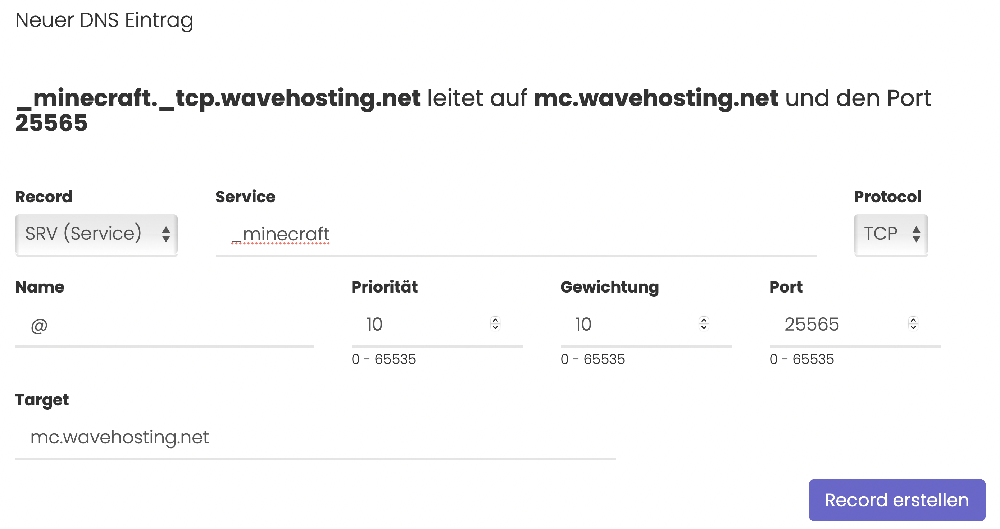

# Domains bei WaveHosting - StartUp Guide
-----
## Wie benutze ich den Guide?
Hier findest du alle **Informationen über die DNS Verwaltung** für deine Domain.

Über die Sidebar ist das Untermenü "DNS Records" erreichbar. Dort wird jeder einzelne erstellbare Record erklärt und welche Funktionen dieser mit sich bringt.

## Die unterschiedlichen DNS Verwaltungen

Die interne DNS Verwaltung kannst du ausschließlich mit unseren Nameservern verwenden. [Mehr dazu findest du hier](#nameserver-für-die-wavehosting-dns-verwaltung).

Du kannst mit deiner Domain bei WaveHosting zwei unterschiedliche Typen von DNS Verwaltungen nutzen. Die Auswahl triffst du durch die Eingabe der Nameserver.
### WaveHosting DNS Verwaltung

Wir haben die WaveHosting DNS Verwaltung für Domains, die unsere Nameserver hinterlegt haben, so einfach wie möglich gestaltet.

Für jeden erstellbaren Record wird gleichzeitig die Konfiguration in Worten in einem Textfeld über den Einstellmöglichkeiten erklärt. So können Records wie der SRV Record oder der MX Record einfacher und schneller erstellt werden.

> Hier ein Beispiel für einen SRV Record zur Weiterleitung auf einen Minecraft Server:

 
### Externe DNS Verwaltung

Du kannst in der Domainverwaltung auch externe Nameserver für die Domain hinterlegen. Die WaveHosting DNS Verwaltung ist dann jedoch nicht mehr verfügbar und die des externen Anbieters muss verwendet werden.

Wir können für externe Dienstleister leider auch nur begrenzt Support geben, weshalb wir unsere internen Nameserver empfehlen.

#### Nameserver für die WaveHosting DNS Verwaltung:

| Nameserver    | Domain Eintrag |
|---------------|----------------|
| 1. Nameserver | a.ns14.net     |
| 2. Nameserver | b.ns14.net     |
| 3. Nameserver | c.ns14.net     |
| 4. Nameserver | d.ns14.net     |
| 5. Nameserver | `leer`         |