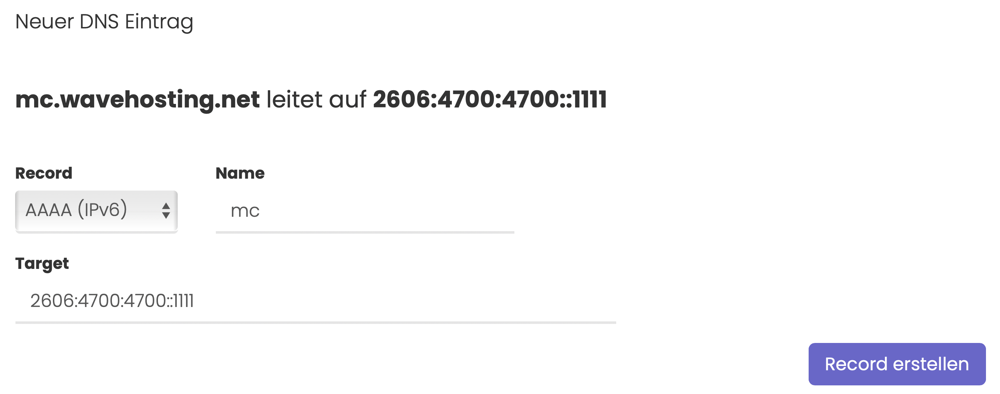

# Was macht ein AAAA Record und wie erstellt man ihn?

## Was ist ein AAAA Record?

Ähnlich wie ein A Record wird ein AAAA Record dazu verwendet um eine Domain, beispielsweise wavehosting.de oder auch wavehosting.net, auf eine IPv6 Adresse "aufzuschalten", damit die Domain die hinterlegte IPv6 auflöst.

Über einen AAAA Record lässt sich zum Beispiel eine Website über die Domain bereitgestellt werden oder die Basis für einen IPv6 basierten [SRV Record](srv-record.md) geschaffen werden. (Nicht alle Services unterstützden den neuen Standard garantiert)

## Wie legt man einen AAAA Record an?

### Step-by-Step Anleitung:

1. Rufe die Verwaltung deine Domain über den Kundenbereich auf.
2. Wähle in der Sidebar den Menüpunkt "DNS Verwaltung" aus - Sollte dieser Punkt nicht angezeigt werden, kannst du die WaveHosting DNS Verwaltung **kostenfrei** über den Sidebar Menüpuntk "Erweiterungen" aktivieren!
3. Wähle im Dropdown den AAAA Record aus.
4. Im Feld "Name" gibst du, wenn gewünscht eine Subdomain ein. Subdomain bedeutet, dass vor deiner Domain ein Präfix steht (bspw. **mc**.wavehosting.net). Ansonsten ein "@" Zeichen als Alias für die Domain selbst eintragen.
5. Im Feld "Target" gibst du die IPv6 Adresse, auf die die Domain, bzw. Subdomain, zeigen soll ein.
6. Klicke auf den Button Record erstellen, um deine Eingaben zu speichern.

> #### Bildliche Abbildung der oben gezeigten Anleitung:

-----
> *DNS Updates können ein wenig Zeit in Anspruch nehmen. Meist liegt das Problem am Cache oder an deinen eigenen, lokalen Nameservern. Wir empfehlen diese manuell auf die von Cloudflare oder Google umzustellen, um die schnellsten Updates zu erhalten.*
>
> *[Hier erfährst du, wie du die Cloudflare Nameserver setzt](https://1.1.1.1/dns/)*.