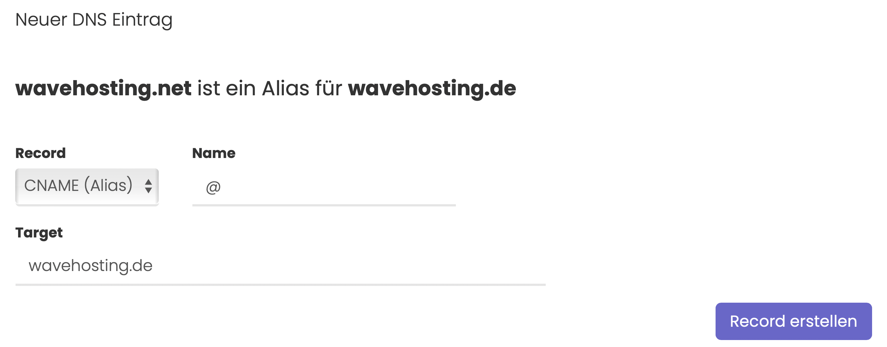

# Was macht ein CNAME Record und wie erstellt man ihn?

## Was ist ein CNAME Record?

Ein CNAME Record wird dazu verwendet, um ein Alias für eine andere Domain bereitzustellen. Beispielsweise ist dank eines CNAME Records die Domain wavehosting.de über die Domain wavehosting.net erreichbar.

Sollte sich die IP Adresse von wavehosting.de ändern, muss der DNS Record der Domain wavehosting.net nicht abgeändert werden und die Website bleibt weiterhin über beide Domains erreichbar.

## Wie legt man einen CNAME Record an?

### Step-by-Step Anleitung:

1. Rufe die Verwaltung deine Domain über den Kundenbereich auf.
2. Wähle in der Sidebar den Menüpunkt "DNS Verwaltung" aus - Sollte dieser Punkt nicht angezeigt werden, kannst du die WaveHosting DNS Verwaltung **kostenfrei** über den Sidebar Menüpuntk "Erweiterungen" aktivieren!
3. Wähle im Dropdown den CNAME Record aus.
4. Im Feld "Name" gibst du, wenn gewünscht eine Subdomain ein. Subdomain bedeutet, dass vor deiner Domain ein Präfix steht (bspw. **web**.wavehosting.net). Ansonsten ein "@" Zeichen als Alias für die Domain selbst eintragen.
5. Im Feld "Target" gibst du die gewünschte Zieldomain, auf die die Domain, bzw. Subdomain, leiten soll ein.
6. Klicke auf den Button Record erstellen, um deine Eingaben zu speichern.

> #### Bildliche Abbildung der oben gezeigten Anleitung:

-----
> *DNS Updates können ein wenig Zeit in Anspruch nehmen. Meist liegt das Problem am Cache oder an deinen eigenen, lokalen Nameservern. Wir empfehlen diese manuell auf die von Cloudflare oder Google umzustellen, um die schnellsten Updates zu erhalten.*
>
> *[Hier erfährst du, wie du die Cloudflare Nameserver setzt](https://1.1.1.1/dns/)*.