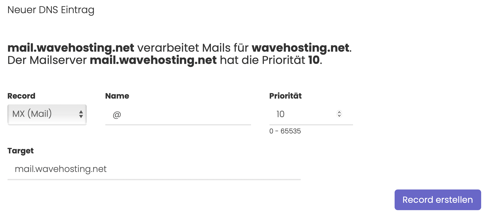

# Was macht ein MX Record und wie erstellt man ihn?

## Was ist ein MX Record?

Ein MX Record wird dazu verwendet, um einen Mailserver mit einer Domain zu verbinden, sodass der Mailserver über die Domain Mails versenden und empfangen kann. Ohne MX Record wissen andere Mailserver nicht, wohin sie die Mails an diese Domain schicken sollen.

MX Records haben eine Besonderheit. Es lässt sich eine Priorität festlegen. Mithilfe dieser Priorität können mehrere Mailserver die E-Mails einer Domain bearbeiten. So lässt sich zum Beispiel eine Redundanz bzw. Ausfallsicherheit erstellen.

Der Mailserver mit der höchsten Priorität wird als Erstes bedient.

## Wie legt man einen MX Record an?

### Step-by-Step Anleitung:

1. Rufe die Verwaltung deine Domain über den Kundenbereich auf.
2. Wähle in der Sidebar den Menüpunkt "DNS Verwaltung" aus - Sollte dieser Punkt nicht angezeigt werden, kannst du die WaveHosting DNS Verwaltung **kostenfrei** über den Sidebar Menüpuntk "Erweiterungen" aktivieren!
3. Wähle im Dropdown den MX Record aus.
4. Im Feld "Name" gibst du, wenn gewünscht eine Subdomain ein. Subdomain bedeutet, dass vor deiner Domain ein Präfix steht (bspw. **web**.wavehosting.net). Ansonsten ein "@" Zeichen als Alias für die Domain selbst eintragen. Bei MX Records ist hier meist ein @ gewünscht.
5. Im Feld "Priority" gibst du die gewünschte Priorität deines Mailservers an.

> #### Was bedeuten Prioritäten bei MX Records?
> So lässt sich durch Hinzufügen mehrerer MX Records und mehrerer Mailserver eine redundante E-Mail Anbindung garantieren, sodass auch wirklich jede Mail zugestellt werden kann.

6. Im Feld "Target" gibst du die Domain deines Mailservers an. 

> #### Wichtig:
> Das Target muss ein FQDN (Fully Qualified Domain Name - Beispiel: mail.wavehosting.net) sein. Also musst du [einen A Record](a-record.md) und/oder [einen AAAA Record](aaaa-record.md) mit Subdomain für den Mailserver anlegen.

7. Klicke auf den Button Record erstellen, um deine Eingaben zu speichern.

> #### Bildliche Abbildung der oben gezeigten Anleitung:

-----
> *DNS Updates können ein wenig Zeit in Anspruch nehmen. Meist liegt das Problem am Cache oder an deinen eigenen, lokalen Nameservern. Wir empfehlen diese manuell auf die von Cloudflare oder Google umzustellen, um die schnellsten Updates zu erhalten.*
>
> *[Hier erfährst du, wie du die Cloudflare Nameserver setzt](https://1.1.1.1/dns/)*.