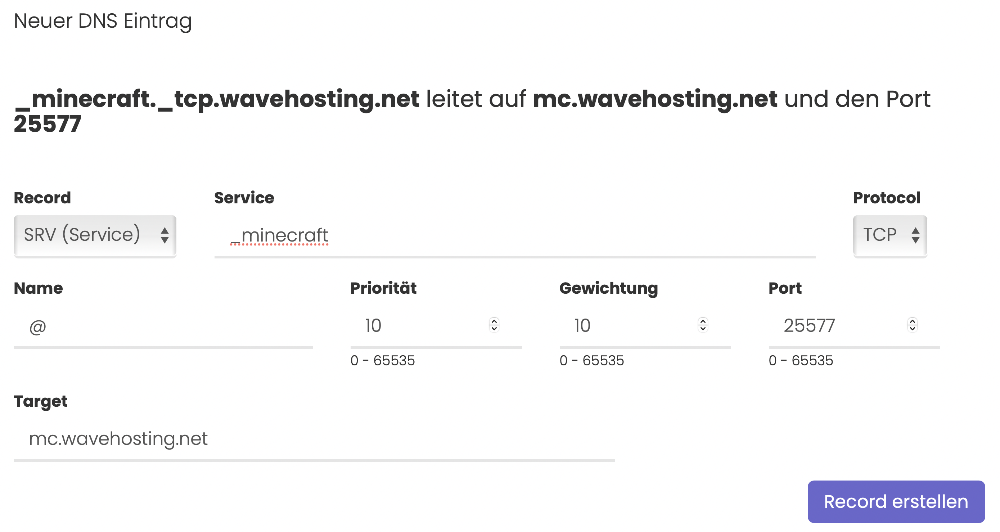

# Was macht ein SRV Record und wie erstellt man ihn?

## Was ist ein SRV Record?

Ein SRV Record kann die Domain für bestimmte Dienste benutzbar machen. Dies sind zum Beispiel Gameserver oder auch Mailserver autoconfig Dienste.

Bei Gameservern kann unter Verwendung von SRV Records auf den Port bei der Domaineingabe verzichtet werden. Über den Autoconfig Dienst von Mailservern kann das Einrichten von E-Mail Postfächern für Clients erleichtert werden.

## Wie legt man SRV Records an?

### SRV Records im Allgemeinen

1. Rufe die Verwaltung deine Domain über den Kundenbereich auf.
2. Wähle in der Sidebar den Menüpunkt "DNS Verwaltung" aus - Sollte dieser Punkt nicht angezeigt werden, kannst du die WaveHosting DNS Verwaltung **kostenfrei** über den Sidebar Menüpuntk "Erweiterungen" aktivieren!
3. Wähle im Dropdown den SRV Record aus.
4. Im Feld "Service" gibst du den gewünschten Service an, der über den Record erreichbar gemacht werden soll.
5. Im Feld "Protocol" wählst du das benötigte Netzwerkprotokoll aus, über das die Pakete bei dem gewählten Service verschickt werden. (TCP/UDP)
6. Im Feld "Name" gibst du, wenn gewünscht eine Subdomain ein. Subdomain bedeutet, dass vor deiner Domain ein Präfix steht (bspw. **mc**.wavehosting.net). Ansonsten ein "@" Zeichen als Alias für die Domain selbst eintragen.
7. Im Feld "Priorität" legst du eine Priorität für diesen SRV Record fest. (Meist 5 oder 10)
8. Im Feld "Gewichtung" legst du eine Gewichtung für diesen SRV Record fest. (Meist 5 oder 10)
9. Im Feld "Port" wählst du den Port aus auf den der SRV Record bzw. der Dienst hört.
10. Im Feld "Target" gibst du den Domainnamen ein, über den der Dienst erreichbar ist. (Keine IPv4/IPv6 - [A Record](a-record.md) / [AAAA Record](aaaa-record.md) erstellen)
11. Klicke auf den Button Record erstellen, um deine Eingaben zu speichern.

> #### Bildliche Abbildung der oben gezeigten Anleitung:

-----
### SRV Records für Minecraft
SRV Records für Minecraft ermöglichen es, den Server ohne Angabe eines Ports, zu betreten, auch wenn der Port des Servers nicht der Standardport ist.

> Erstelle eine Subdomain mittels eines [A Records](a-record.md) auf die IP deines Minecraftservers.

Befolge anschließend zum Anlegen eines SRV Records für Minecraft die Schritte aus dem Punkt [SRV Records im Allgemeinen](#srv-records-im-allgemeinen). Folgende Einträge musst du setzen:

- Für Minecraft benötigt man als "Service" den Dienst `_minecraft`
- Minecraft nutzt als Netzwerkprotokoll den Typ `TCP`
- Gib im Feld "Target" die zu Beginn erstellte Subdomain für deinen Minecraftserver an.

> #### Diese Konfiguration leitet die Domain `wavehosting.net` auf den Minecraftserver hinter `mc.wavehosting.net`. Dieser ist auf den Port 25577 konfiguriert:

-----
### SRV Records für FiveM
SRV Records für FiveM ermöglichen es, den Server ohne Angabe eines Ports, zu betreten, auch wenn der Port des Servers nicht der Standardport ist.

> Erstelle eine Subdomain mittels eines [A Records](a-record.md) auf die IP deines FiveM Servers.

Befolge anschließend zum Anlegen eines SRV Records für Minecraft die Schritte aus dem Punkt [SRV Records im Allgemeinen](#srv-records-im-allgemeinen). Folgende Einträge musst du setzen:

- Für FiveM benötigt man als "Service" den Dienst `_cfx`
- Minecraft nutzt als Netzwerkprotokoll den Typ `UDP`
- Gib im Feld "Target" die zu Beginn erstellte Subdomain für deinen Minecraftserver an.

> #### Diese Konfiguration leitet die Domain `wavehosting.net` auf den FiveM Server hinter `fivem.wavehosting.net`. Dieser ist auf den Port 30110 konfiguriert:

-----
> *DNS Updates können ein wenig Zeit in Anspruch nehmen. Meist liegt das Problem am Cache oder an deinen eigenen, lokalen Nameservern. Wir empfehlen diese manuell auf die von Cloudflare oder Google umzustellen, um die schnellsten Updates zu erhalten.*
>
> *[Hier erfährst du, wie du die Cloudflare Nameserver setzt](https://1.1.1.1/dns/)*.