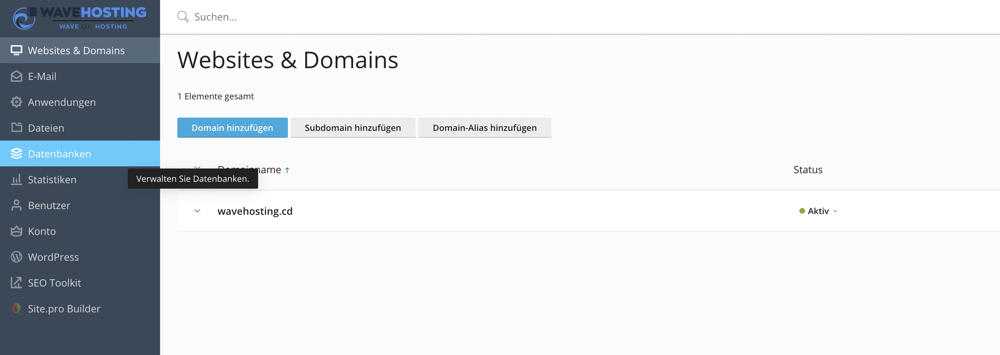
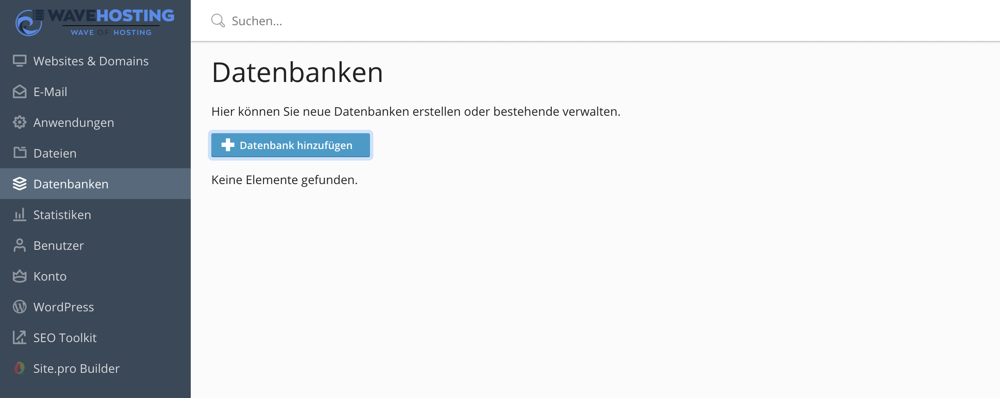

# Datenbanken in Plesk
Hier erfährst du wie man, in unserer Administrationsoberfläche Plesk, Datenbanken erstellen, verwalten und exportieren kann.

-----
## Grundlegendes

Um Datenbanken in Plesk erstellen und verwalten zu können, navigiere mittels Klick auf den Reiter "Datenbanken" in der Sidebar in die entsprechende Übersicht. Von dort aus werden alle weiteren Aktionen beschrieben.

### Datenbank erstellen

Klicke auf den Button "Datenbank hinzufügen" um eine neue Datenbank zu erstellen.

Im folgenden Formular kannst du einen Datenbanknamen, den gewünschten Datenbankserver (MariaDB oder PostgreSQL) und eine zugehörige Website festlegen.

Außerdem lässt sich direkt bei dem Erstellen einer neuen Datenbank ein neuer Datenbankbenutzer hinzufügen. 

> Standardmäßig hat dieser nur Zugriff auf die aktuelle Datenbank. Über den letzten Haken lässt sich der Benutzer für alle Datenbanken freischalten.

Nach Erstellung der Datenbank wird diese in der Übersicht als Listenelement angezeigt.

### Datenbank verwalten

Über den Button "phpMyAdmin" gelangst du in die phpMyAdmin Weboberfläche. Die Plesk Software meldet dich direkt an und du kannst mit der Erstellung deiner Datenbank beginnen.
Dein Benutzer hat vollen Verwaltungszugriff und kann die Datenbank verwalten.

### Datenbank importieren / exportieren

Mit den Schaltflächen "Abbild exportieren" / "Abbild importieren" kannst du eine .sql Datei generieren und herunterladen bzw. hochladen. So lassen sich Backups und Migrationen schnell und einfach durchführen.